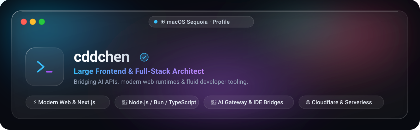
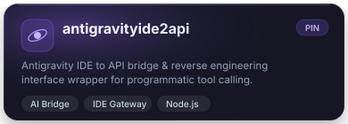
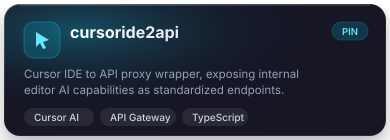
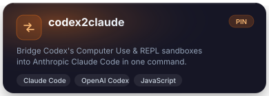
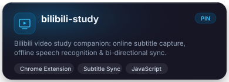

  

 

###  Featured Projects · 精选置顶

<table width="100%">
  <tr>
    <td width="50%" align="center">
      
    </td>
    <td width="50%" align="center">
      
    </td>
  </tr>
  <tr>
    <td width="50%" align="center">
      
    </td>
    <td width="50%" align="center">
      
    </td>
  </tr>
</table>

 

### 🛠️ Tech Stack & Ecosystem · 大前端与全栈生态

#### ✦ Frontend & Web Architecture

#### ✦ Full-Stack Runtimes & Backend

#### ✦ Tooling, Cloud & Extensions

 

### 📈 Activity & Streak · 研发活跃度

  

 

---

  

